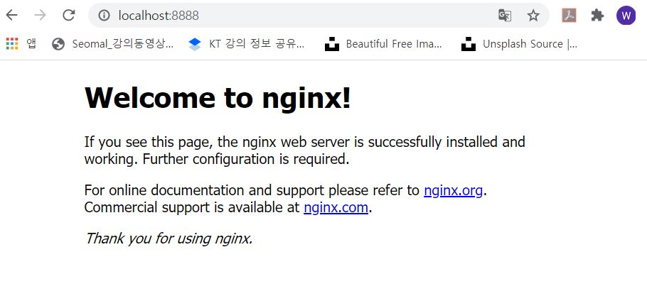

# 간단한 설명 #

##### 1. Nginx 이미지 Build #####
docker build --rm -t kimws0807/workshop

##### 2. Nginx 이미지 Run #####
winpty docker run -it --name workshop -p 8888:80 kimws0807/workshop:1.0

##### 3. Nginx Server 접속 #####

