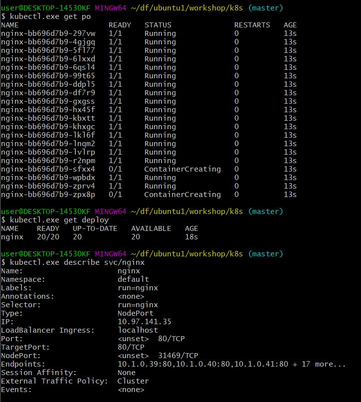

# 간단한 설명#

### sh k8s.sh 실행 ###

##### 만든 이미지로 Deployment #####
kubectl.exe run nginx --image=kimws0807/workshop:1.0 --port=80

##### Pod 20개로 확장 #####
kubectl scale deployment nginx --replicas=20

##### Service Port 80으로 설정 #####
kubectl.exe expose deployment/nginx --type="NodePort" --port=80

### 최종결과 ###
